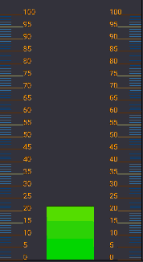
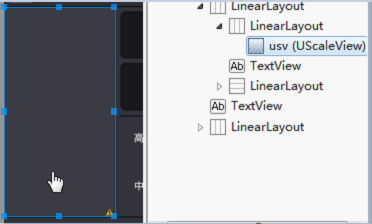
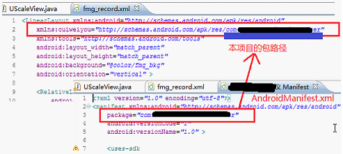
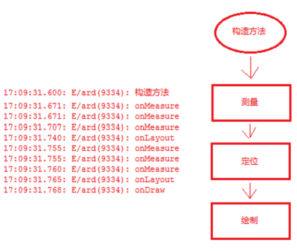
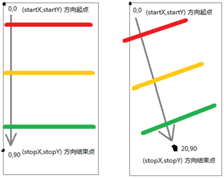
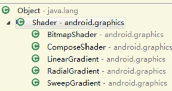
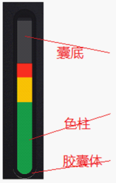
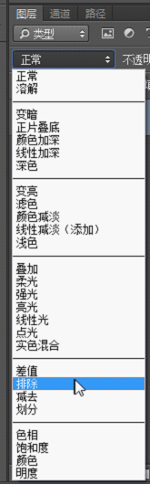
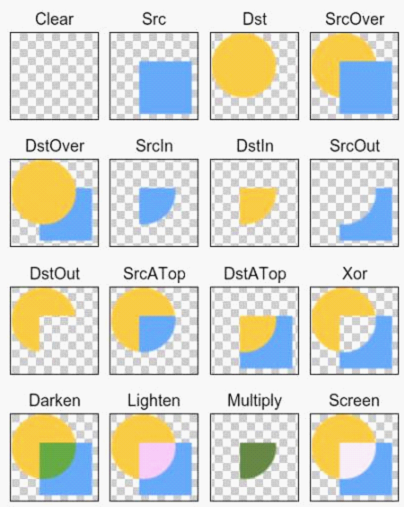

2016-01-20 19:03发布于oschina<br/>
<br/>

一．渐变色刻度值View控件
===================================
 

1.设计
-----------------------------------
1）希望能在xml里注册这个控件，通过xml配置一些初始参数，如：最小值、最大值、刻度线颜色长度、刻度文本颜色...；
2）色柱的高度是动态的，当制定新的高度后，绘制的色柱即为新高度，并且顶部位置对应刻度线的位置；
3）颜色渐变的位置是可控的，如：绿色渐变到黄色，在某个“刻度”发生；

2.技术分析
-----------------------------------
### 1）实现xml配置
（1）attrs.xml
在 /res/values/ 里新建一个attrs.xml文件，格式内容如下：
``` xml
<?xml version="1.0" encoding="UTF-8"?>
<resources>
    <!-- 自定义类的属性 -->
    <!-- 自定义属性集合 name=自定义名称 -->
    <declare-styleable name="UScaleViewAttrs">
        <!-- 使用模式，1:水平，0:垂直 -->
        <attr name="typeHorizontalOrVertical" format="integer" />
        <!-- 展示模式，2:表盘，1:居中线，0:圆柱 -->
        <attr name="typeFanOrLineOrCylinder" format="integer" />
        
        <!-- 最大刻度 -->
        <attr name="valueMaxScale" format="integer" />
        <!-- 最小刻度 -->
        <attr name="valueMinScale" format="integer" />
        
        <!-- 默认刻度线颜色 -->
        <attr name="colorLineNormal" format="color" />
        <!-- 节点刻度线颜色 -->
        <attr name="colorLineNode" format="color" />
        
        <!-- 节点文本字号 -->
        <attr name="sizeOfText" format="dimension" />
        
        <!-- 刻度线宽度，画笔笔触宽度 -->
        <attr name="sizeWidthOfLine" format="integer" />
        <!-- 默认刻度线长度 -->
        <attr name="sizeLongOfLineNormal" format="integer" />
        <!-- 节点刻度线长度 -->
        <attr name="sizeLongOfLineNode" format="integer" />
        <!-- 刻度线间隔 -->
        <attr name="spaceBetweenLine" format="integer" />
        
        <!-- 是否可以接收touch事件 -->
        <attr name="touchEnable" format="boolean" />
    </declare-styleable>
</resources>
```

注意其根节点为 resources，然后一级子节点为 declare-styleable ，最内部是具体到每个控件属性的节点，如
<attr name="valueMaxScale" format="integer" />
attr，即声明一个属性，name中的字符串即属性的名称，format即属性值的数据类型。format可用的有很多，integer为单纯的数字，dimension为像素单位dp。color为“#ffffff”这种颜色值。其它string等同java。

在这个文件里声音一切会用到的、可能用到的、希望用到的属性。
记好这个 declare-styleable 的name 是 UScaleViewAttrs 。因为从下文你会发现，在java中获取attr节点配置的属性时是通过“UScaleViewAttrs_属性名”这种形式拿到的。

（2）自定义View
既然是在xml里配置实用，那么重写View时，就应该重写至少2个参数的构造方法。其 AttributeSet attrs 属性可以直接拿到xml里配置的属性集合。
``` java
private UScaleView(Context context, AttributeSet attrs) {
	TypedArray attributes = context.obtainStyledAttributes(attrs, R.styleable.UScaleViewAttrs);
	sizeLongOfLineNode = attributes.getInteger(R.styleable.UScaleViewAttrs_sizeLongOfLineNode, 50);
	sizeOfText = attributes.getDimension(R.styleable.UScaleViewAttrs_sizeOfText, 12);
	colorLineNormal = attributes.getColor(R.styleable.UScaleViewAttrs_colorLineNormal, Color.parseColor("#000000"));
	touchEnable = attributes.getBoolean(R.styleable.UScaleViewAttrs_touchEnable, false);
     attributes.recycle();
}
```

attributes是通过上下文 根据attrs.xml 里配置的属性数据类型，读取xml中使用本控件时配置的属性值，封装后的属性数组。
我们可以使用attributes的getXXX方法针对性的拿到xml配置的属性值。如上面代码中sizeLongOfLineNode即为int类型的成员变量，它对应的属性即在attrs.xml里为integer。而sizeOfText也是int，但在attrs.xml里配置的数据类型为dimension，是一个dp数值。基本上每个get方法都有2个参数，第一个对应xml里的属性名，第2个为一个默认值，当从xml里读不到相关属性时，就指定为此默认值。
注意用完后，recycle。

除了属性的初始化，一般还对用到的Paint进行初始化。Canvas会在onDraw方法中由系统提供。

（3）xml中的引用<br/>
 
<br/>
看代码，这个自定义控件放在一个LinearLayout里，注意width和height都是android命名空间下的属性：
``` xml
<LinearLayout
    android:layout_width="0dp"
    android:layout_height="match_parent"
    android:layout_weight="1"
    android:orientation="horizontal" >

    <com.cuiweiyou.UScaleView
        android:id="@+id/usv"
        android:layout_width="match_parent"
        android:layout_height="match_parent"
        cuiweiyou:colorLineNode="#ff9900"
        cuiweiyou:colorLineNormal="#0099ff"
        cuiweiyou:sizeLongOfLineNode="50"
        cuiweiyou:sizeLongOfLineNormal="30"
        cuiweiyou:sizeOfText="9dp"
        cuiweiyou:sizeWidthOfLine="1"
        cuiweiyou:spaceBetweenLine="50"
        cuiweiyou:touchEnable="false"
        cuiweiyou:typeFanOrLineOrCylinder="0"
        cuiweiyou:typeHorizontalOrVertical="1"
        cuiweiyou:valueMaxScale="100"
        cuiweiyou:valueMinScale="0" />
</LinearLayout>
```
“cuiweiyou” 是我们自定义的命名空间，后面的 colorLineNode、sizeLongOfLineNode、spaceBetweenLine、touchEnable都是在 attrs.xml 里配置好了的。
需要注意的是，并非这里声明了属性，View的构造方法里就得初始化。仅初始化用到的，所以这里声明了的并非就是有效的。同样上文说到了，你这里没有声明的属性，我们会在构造方法里给个默认值。

看看 cuiweiyou 这个命名空间怎么来的：<br/>
 <br/>
如图，在布局文件中，最外层的容器中声明一个xmlns为cuiweiyou，这个约束指向本项目的包名。

### 2）色柱高度 
 首先明确View的生命周期，看简图所示xml中注册的view生命周期：<br/>
 
<br/>
无论onMeasure测量多少次，最后终究会执行onLayout定位，并最终onDraw绘制控件。
在onMeasure中，确定本控件的宽高，在onLayout中确定子元素的位置。
但是要获取本view的最终宽高，一般都在onLayout中通过get方法获取，此时的数值是准确数值。

（1）控件的高度
看一段典型代码：
``` java
/** 测量本控件宽高
 * TODO wrap_content 尚未处理（累加刻度线、文字的宽高） */
@Override
protected void onMeasure(int widthMeasureSpec, int heightMeasureSpec) {
	super.onMeasure(widthMeasureSpec, heightMeasureSpec);
     	
    int widthMode = MeasureSpec.getMode(widthMeasureSpec); 
    int widthSize = MeasureSpec.getSize(widthMeasureSpec); 
    int heightMode = MeasureSpec.getMode(heightMeasureSpec); 
    int heightSize = MeasureSpec.getSize(heightMeasureSpec); 
    int width;
    int height;
    
    if (widthMode == MeasureSpec.EXACTLY){ 
        width = widthSize;
    } else { 
        width =  (int) (getPaddingLeft() + getPaddingRight()); // 1.
    }
    if (heightMode == MeasureSpec.EXACTLY) {
        height = heightSize;
    } else {
        height = (int) (getPaddingTop() + getPaddingBottom());  // 2.
    }
    
    setMeasuredDimension(width, height);
}
```
此代码仅适用于martch_parent和制定具体dp的情况，如果是wrap_content，还须要在 注释 1. 2. 行中加上子元素的宽高。 
<br/>
（2）元素定位
示例代码，获取view最终的宽高。

除了获取宽高，还会根据xml配置的刻度线间隔、最大值、最小值等进行计算，以优化绘制效果。如：这个view在屏幕上最终占据的宽高是有限的，如果在限定高度内，按最大值和最小值计算刻度线间隔，与xml里配置的数值有差距，就须要处理一下。
此时也看出，如果设计不合理，可能一下原定属性就没有用处。

### 3）颜色渐变位置
 （1）创建渐变色
对于渐变色，Android中提供了 LinearGradient 对象，常用的一种构造方法：
``` java
LinearGradient shader = new LinearGradient(
		starX,                      // 起点x
		0,                          // 起点y
		starX,                      // 终点x
		height - paddingBottom,     // 终点y
        new int[] {                 // 颜色数组，从屏幕顶部到底部
				Color.RED, 
				Color.YELLOW, 
				Color.GREEN}, 
        null,                        // 过渡位置 new float[]{0 , 0.5f, 1.0f}，长度和颜色数组相同
        Shader.TileMode.REPEAT);     // CLAMP:边界像素拉伸。REPEAT:平铺拉伸位图。MIRROR:镜像渲染。
```

注意理解前4个参数指定的渐变方向：<br/>
 
 <br/>
垂直于方向上的像素的颜色是相同的。

第6个参数，如果为null，则按照第5个参数中颜色数组长度平分颜色比例，否则就按照指定的比例。当然不为null时，两个数组的长度须相同。

第7个参数，Shader.TileMode有3种参数可供选择，分别为CLAMP、REPEAT和MIRROR：
CLAMP的作用是如果渲染器超出原始边界范围，则会复制边缘颜色对超出范围的区域进行着色；
REPEAT的作用是在横向和纵向上以平铺的形式重复渲染位图；
MIRROR的作用是在横向和纵向上以镜像的方式重复渲染位图。
<br/>
（2）绘制
将此渐变色作为画笔的颜色：
``` java
Paint paint = new Paint();
paint.setShader(shader); // 指定渐变色填充 
```

LinearGradient限定了渐变方向（渐变发生的距离），当画笔在其某个位置时，绘出的像素就是对应的颜色。超出其限定距离时，即按照TileMode 指定的模式绘制，或镜像色，或拉伸色等。

而画笔到底能画多大的画面，还是由Canvas说了算：
``` java
// 定义矩形（左 上 右 下）
RectF cylinder = new RectF(starX, paddingTop + valueOfDB, starX + widthOfCylinder, height - paddingBottom);
canvas.drawRect(cylinder, paint);
```
这里RectF为一个矩形区域，其规定的左上右下圈定的范围，是画笔可以绘制像素的范围，超出这个范围就没有作用。为了可视效果的美观，要根据LinearGradient限定的方向距离进行优化。

还要注意的是，同上图所示。绘制是从View的左上角开始的，LinearGradient和RectF中的x、y也都是相对于View而言的。而我们想看的色柱按常理是落在view的底部，所以，为了确保色柱在view底，其“stopY一定就是view的高”，startY即view的高减去色柱的高。
<br/>

### 4）刻度绘制 
 这一部分就比较简单了。
``` java
// 画线（startX，startY，stopX，stopY，画笔）
canvas.drawLine(startX, startY, stopX, stopY, paint);
```
按照比例分好间距，依次累加改变startX、stopY更新即可。按照既定效果，分别两侧画出。
<br/>

二．三纯色刻度值View控件
=============================================
 <br/>

这个和渐变色完全是两回事，从图中看出，关键还是左侧的胶囊色柱。Android并未提供类似于LinearGradient 这种可以指定纯色的对象。虽然提供了其兄弟类型ComposeShader，可以嵌套2个LinearGradient或2个BitmapShader或LinearGradient+BitmapGradient，但经测试，绘出的却是白色。
 <br/>
 <br/>
 好在Canvas还有一个 drawBitmap 方法，可以绘制bitmap类型的数据，如果这个bitmap就是3中颜色，那么就能有效果了。

本章节就不对 构造方法、测量、定位 赘述了。
<br/>
1.Bitmap创建
-------------------------------------------
直接从图片加载bitmap：
``` java
bmpRed = ((BitmapDrawable) getResources().getDrawable(R.drawable.red)).getBitmap();
bmpYellow = ((BitmapDrawable) getResources().getDrawable(R.drawable.yellow)).getBitmap();
bmpGreen = ((BitmapDrawable) getResources().getDrawable(R.drawable.green)).getBitmap();
```
按比例缩放bitmap，得到新的bitmap：
``` java
matrixRed = new Matrix();
matrixRed.postScale(50, redHeight / 10); // 水平、垂直，缩放倍数
bmp_red = Bitmap.createBitmap(bmpRed, 0, 0, 10, 10, matrixRed, true); // (源bmp，裁剪startx，starty，裁剪的宽，高)
```
2.Bitmap拼接
-------------------------------------------
通过上面的方法，得到3个合适宽高的纯色的bitmap，然后用下面的代码将之合并到一个bitmap：
``` java
multiColorBmp = Bitmap.createBitmap(width, multiHeight, Config.ARGB_8888);
Canvas ccc = new Canvas(multiColorBmp); 
ccc.drawBitmap(bmp_red, 0, 0, null);
ccc.drawBitmap(bmp_yellow, 0, bmp_red.getHeight(), null);
ccc.drawBitmap(bmp_green, 0, bmp_yellow.getHeight() + bmp_red.getHeight(), null);
```
此时的multiColorBmp即最终可以绘制到胶囊里的色柱。

3.纯色绘制
-------------------------------------------
 <br/>
因为项目的需要，囊体和囊底都是图片，所以这里还有个问题，如何让色柱绘制的时候，只在规定高度内显示，其余部分又能正常显示囊底。

一个新的对象 PorterDuffXfermode 。它给出的概念如果PhotoShop中图层的叠加模式：
<br/>
 <br/>
<br/>
网上的资料：<br/>
 
<br/>
再明确一个概念：首先绘制出的为dst，再次绘制的为src。所以，首先绘制囊底，囊底是dst，要让再次绘制的色柱src仅遮挡其高度内的像素，那么可以使用SRC_ATop(测试SRC_IN亦可）。

具体代码：
``` java
@Override
protected void onDraw(Canvas canvas) {
	super.onDraw(canvas);

	int sc = canvas.saveLayer(0, 0, width, height, null, Canvas.ALL_SAVE_FLAG);

	Rect rect = new Rect(0, 0, width, height);
	canvas.drawBitmap(bmp, rect, rect, paint); // 已绘制的为dst

	paint.setXfermode(mFermode);   // 图像叠加方式

	if(null != multiColorBmp){
		canvas.drawBitmap(multiColorBmp, 0, height - multiColorBmp.getHeight(), paint);
	}
	
	paint.setXfermode(null);

	canvas.restoreToCount(sc); // 去除黑边
}

```
<br/>
<hr/>
 
 [UScaleView](http://www.cuiweiyou.com/1799.html)
<br/>
<br/>